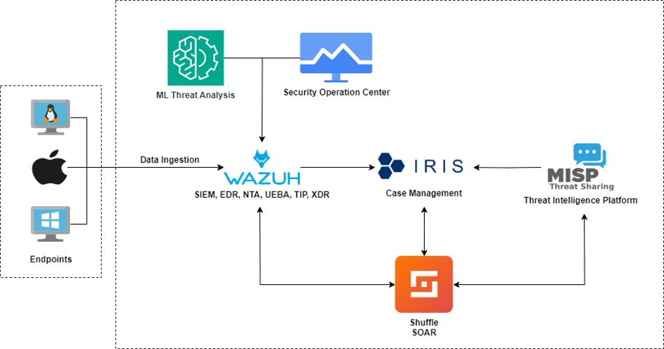

# SCOC Integration

## Overview

The SCoc Integration project encompasses a robust suite of tools designed to provide comprehensive security operations capabilities. This integration leverages the strengths of several powerful platforms to enhance threat detection, incident response, and overall security posture.

## Tools and Technologies

### Elasticsearch - Machine Learning

Elasticsearch's machine learning capabilities are integrated to provide advanced analytics and anomaly detection. This enables proactive identification of potential threats based on data patterns and trends.

### Wazuh

Wazuh serves as the core SIEM (Security Information and Event Management) platform in this integration. It offers a range of features, including:
- **SIEM**: Security Information and Event Management
- **EDR**: Endpoint Detection and Response
- **XDR**: Extended Detection and Response
- **TIP**: Threat Intelligence Platform
- **UEBA**: User and Entity Behavior Analytics
- **NTA**: Network Traffic Analysis

### Shuffle - SOAR

Shuffle is integrated as the SOAR (Security Orchestration, Automation, and Response) platform. It automates workflows and integrates with other security tools to streamline response processes and improve efficiency.

### DFIR-IRIS - Incident Response Platform

DFIR-IRIS is used as the incident response platform, providing comprehensive tools and workflows to manage and respond to security incidents effectively.

### MISP - Threat Intelligence Platform

MISP (Malware Information Sharing Platform) is incorporated as the Threat Intelligence Platform. It facilitates the sharing, storing, and correlating of Indicators of Compromise (IoCs) and threat intelligence data.

## Architecture



## Getting Started

To get started with SCoc Integration, follow these steps:

1. **Clone the Repository**:
    ```bash
    git clone https://github.com/siogy/scoc-integration.git
    ```
2. **Navigate to the Project Directory**:
    ```bash
    cd scoc-integration
    ```
3. **Installation**:
    - Follow the installation guides for each integrated tool.
    - Ensure proper configuration as per the documentation provided.

## Usage

Detailed usage instructions for each tool are available in their respective documentation sections. Below are some quick links to get you started:

- [Elasticsearch](https://www.elastic.co/guide/en/elasticsearch/reference/index.html)
- [Wazuh](https://documentation.wazuh.com/)
- [Shuffle](https://shuffler.io/docs)
- [DFIR-IRIS](https://dfir-iris.readthedocs.io/)
- [MISP](https://www.misp-project.org/documentation/)

## Contributing

We welcome contributions from the community. To contribute, please follow these steps:

1. **Fork the Repository**: Click on the 'Fork' button at the top right of this page.
2. **Clone Your Fork**:
    ```bash
    git clone https://github.com/siogy/scoc-integration.git
    ```
3. **Create a Branch**:
    ```bash
    git checkout -b feature-branch
    ```
4. **Make Your Changes**: Implement your changes and commit them.
5. **Push to Your Fork**:
    ```bash
    git push origin feature-branch
    ```
6. **Create a Pull Request**: Open a pull request on the original repository.

## License

This project is licensed under the MIT License. See the [LICENSE](LICENSE) file for details.

## Contact

For any inquiries, please contact us at Telegram [@enparis](https://t.me/enparis).

---

Thank you for using SCoc Integration!
